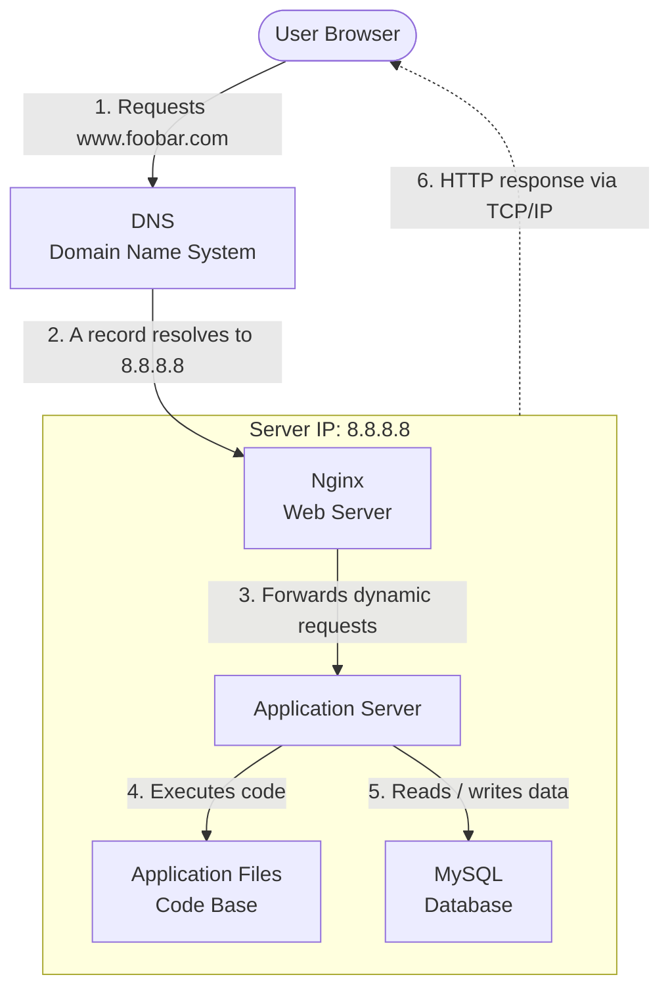

# Web infrastructure design

## Simple web stack

### Diagram

---

### Infrastructure Overview

A user types `www.foobar.com` into their browser. The browser queries the DNS system to translate `www.foobar.com` into the IP address `8.8.8.8`. The browser then connects to the server at that IP address over TCP/IP and sends an HTTP request. Nginx receives the request, serves static files directly, or forwards dynamic requests to the application server. The application server executes the code base and queries the MySQL database when it needs to read or write application data. The response is sent back to the user's browser over TCP/IP.

---

### Specifics

**What is a server**
- A server is a physical or virtual machine, generally located in a data center, that runs an operating system and provides services to clients over a network. In this infrastructure it hosts Nginx, the application server, the code base and the MySQL database.

**Role of the domain name**
- A domain name (`foobar.com`) is a human-readable label that maps to an IP address. It lets users reach a website without knowing its IP address. The DNS system performs the translation.

**DNS record type for `www`**
- The `www` record in `www.foobar.com` is an **A record**. An A record maps a hostname directly to an IPv4 address (`8.8.8.8`).

**Role of the DNS**
- The DNS translates a domain name into an IP address so the browser knows where to send the request.

**Role of the web server**
- The web server (Nginx) receives HTTP requests and serves static content (HTML, CSS, images, JavaScript files) directly to the user.

**Role of the application server**
- The application server computes dynamic content. It runs the application code, processes business logic, and generates the response that is sent back to the user.

**Role of the application files (code base)**
- The application files contain the source code that the application server executes to generate dynamic responses.

**Role of the database**
- The database (MySQL) stores the application data (users, posts, settings, etc.) so that it persists between requests and server restarts.

**Communication between server and user**
- The server communicates with the user's computer over the network using the **TCP/IP** protocol suite. HTTP (or HTTPS) runs on top of TCP/IP to exchange web requests and responses.

---

### Issues With This Infrastructure

**Single Point of Failure (SPOF)**
- This infrastructure is a single point of failure because nothing is redundant. Every component — the web server, application server, database — runs on one machine. If that machine fails, the entire website goes down.

**Downtime during maintenance**
- When new code is deployed, the web server needs to be restarted. During that restart, the website is temporarily unavailable because there is no second server to handle traffic.

**Cannot scale**
- This infrastructure cannot scale. If incoming traffic exceeds the capacity of the single server (CPU, RAM, bandwidth), the server will become slow or unresponsive and there is no way to distribute the load.
