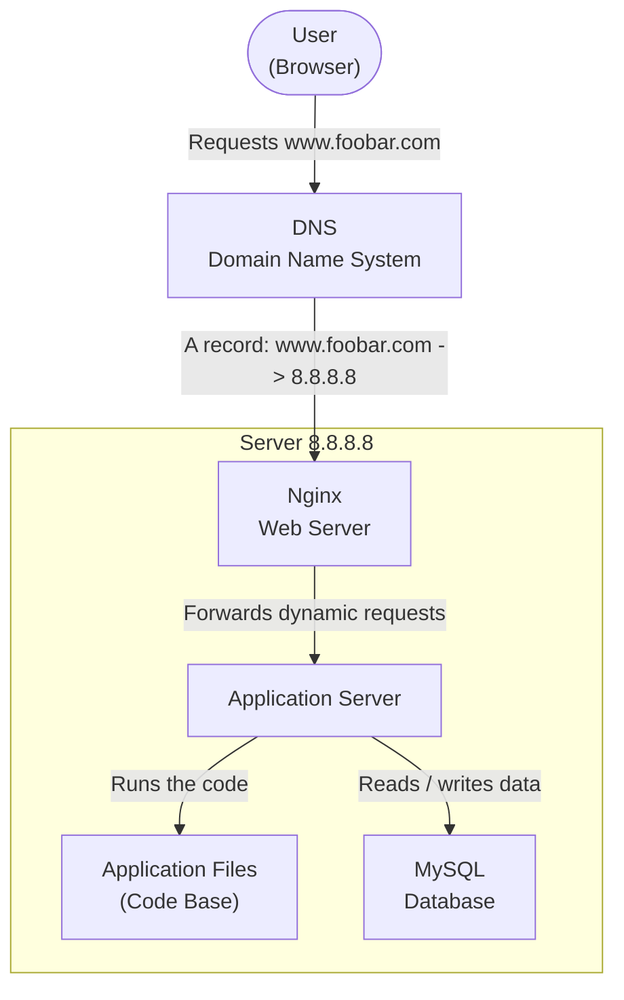

# Web Infrastructure Design

## Task 0. Simple Web Stack

### Architecture Diagram

---

### Explanation

This infrastructure represents a simple one-server web stack hosting the website `www.foobar.com`.

When a user wants to access the website, they type `www.foobar.com` into their browser. The browser first needs to know which IP address is associated with this domain name. To do that, it asks the DNS system. The DNS resolves `www.foobar.com` to the server IP address `8.8.8.8`.

Once the browser has the IP address, it sends an HTTP request to the server. The request reaches the Nginx web server, which is responsible for receiving web traffic. Nginx can directly serve static content, such as images, CSS files or JavaScript files. If the request requires dynamic content, Nginx forwards it to the application server.

The application server runs the application logic. It uses the application files, which are the code base of the website. When the application needs persistent data, it communicates with the MySQL database. The database stores information such as users, content, settings or any other data that must remain available after the request is finished.

The response is then sent back from the server to the user's browser over the network.

---

### Definitions

**Server:**
A server is a physical or virtual machine that provides services to clients over a network. In this infrastructure, the server hosts all the components required to run the website: the web server, the application server, the application files and the database.

**Domain name:**
A domain name is a human-readable address used to access a website without typing its IP address directly. In this case, `foobar.com` is the domain name, and `www.foobar.com` is the full hostname used by the user to reach the website.

**DNS:**
DNS stands for Domain Name System. It translates human-readable domain names into IP addresses that computers can use to communicate with each other. Without DNS, the user would need to type the server IP address directly instead of using `www.foobar.com`.

**DNS record type:**
The `www` record in `www.foobar.com` points to the server IP address `8.8.8.8`. Since `8.8.8.8` is an IPv4 address, this is an **A record**. An A record maps a hostname to an IPv4 address.

**Web server:**
The web server, here Nginx, receives HTTP requests from the user's browser. It can serve static files directly or forward dynamic requests to the application server. It acts as the entry point of the web application.

**Application server:**
The application server runs the business logic of the website. It executes the application code, processes user requests, generates dynamic responses and communicates with the database when data is needed.

**Application files:**
The application files are the code base of the website. They contain the source code needed by the application server to run the website.

**Database:**
The database, here MySQL, stores persistent data. This means the data remains stored even after a request is completed or the application is restarted.

**Communication with the user:**
The server communicates with the user's computer using the HTTP protocol over TCP/IP. HTTP defines how the browser and the server exchange web requests and responses, while TCP/IP handles communication across the network.

**LAMP:**
LAMP stands for Linux, Apache, MySQL and PHP. It is a common web stack used to host dynamic websites. In this project, the stack is similar, but Nginx is used instead of Apache.

**SPOF:**
SPOF stands for Single Point of Failure. It means that if one critical component fails, the whole system becomes unavailable.

---

### Issues With This Infrastructure

**Single Point of Failure:**
This infrastructure has a major single point of failure because everything runs on one server. If the server goes down, the entire website becomes unavailable. The web server, application server and database are all hosted on the same machine, so the failure of this machine affects the whole system.

**Downtime during maintenance:**
Maintenance can cause downtime. For example, if new code needs to be deployed or if the web server must be restarted, the website may become temporarily unavailable because there is no second server to handle traffic during the operation.

**No scalability:**
This infrastructure cannot easily scale. Since all traffic goes to a single server, the server has limited CPU, memory, disk and network capacity. If traffic increases too much, the server may become slow or stop responding.

**Too much incoming traffic:**
If the website receives too many requests, the single server can become overloaded. There is no load balancer and no additional server to share the traffic.

**Database limitation:**
The database is also hosted on the same server. If the database consumes too many resources, it can slow down the web server and the application server. All components compete for the same machine resources.

---

### Summary

This simple web infrastructure is easy to set up and understand, but it is not reliable or scalable. It is useful for small projects or learning purposes, but it has serious limitations because it relies on a single server.
