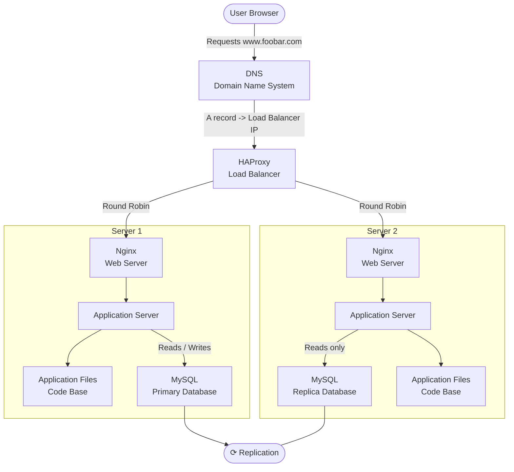

# Web infrastructure design

## Distributed web infrastructure

### Diagram



---

### Infrastructure Overview

When a user requests `www.foobar.com`, the DNS resolves the domain to the load balancer's IP address. HAProxy distributes incoming requests between Server 1 and Server 2 using the Round Robin algorithm. Each server runs a full web stack: Nginx, an application server, the code base, and a MySQL database. The MySQL Primary database on Server 1 accepts all write operations. The Replica database on Server 2 copies data from the Primary via replication and serves read operations.

---

### Additional Elements — Why Each Was Added

**Load balancer (HAProxy)**
- Added to distribute traffic between two backend servers. Without it, all requests would go to a single server, which limits capacity and creates a single point of failure at the application layer.

**Second server**
- Added to provide redundancy for the web and application layers. With two servers, the infrastructure can handle more traffic and survive the failure of one backend server.

**Database replica**
- Added so that the Primary database is not the only copy of the data. The replica also allows read operations to be offloaded from the Primary.

---

### Specifics

**Load balancer distribution algorithm**
- HAProxy is configured with the **Round Robin** algorithm. It sends each new request to the next server in turn:

```
Request 1 -> Server 1
Request 2 -> Server 2
Request 3 -> Server 1
Request 4 -> Server 2
```

- This distributes load evenly when both servers have similar capacity.

**Active-Active vs Active-Passive**
- This setup uses an **Active-Active** configuration: both servers are running and handling requests simultaneously.
- In an **Active-Passive** setup, one server handles all traffic while the second server stays idle as a standby. The standby only receives traffic if the active server fails.

**How a Primary-Replica (Master-Slave) database cluster works**
- The Primary database accepts all write operations (INSERT, UPDATE, DELETE). It logs every change and sends those changes to the Replica database via replication. The Replica applies those changes to stay synchronized with the Primary. This allows the Replica to serve read queries while the Primary focuses on writes.

**Difference between Primary and Replica for the application**
- The application sends all write operations (creating, updating, deleting data) to the **Primary** database. Read operations (fetching data) can be sent to the **Replica** database to reduce the load on the Primary.

---

### Issues With This Infrastructure

**Single Points of Failure (SPOF)**
- The load balancer is a SPOF. If HAProxy fails, no traffic reaches the backend servers and the website goes down. The Primary database is also a SPOF for write operations: if it fails, the application can no longer write data.

**No firewall**
- There is no firewall on any server. Incoming and outgoing network traffic is not filtered. Servers are exposed to unauthorized access attempts and malicious traffic.

**No HTTPS**
- Traffic is unencrypted. If someone intercepts the traffic between the user and the website, they can read or modify the data being exchanged.

**No monitoring**
- There is no monitoring system. There is no way to automatically detect failures, track server health, or receive alerts when something goes wrong.
