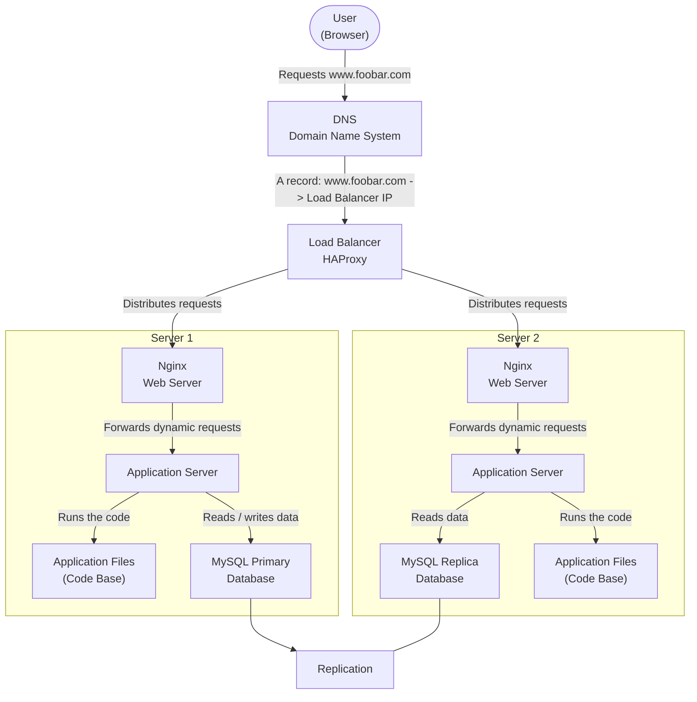

# Web Infrastructure Design

## Task 1. Distributed Web Infrastructure

### Architecture Diagram



---

### Explanation

This infrastructure represents a distributed web infrastructure hosting the website `www.foobar.com`.

When a user wants to access the website, they type `www.foobar.com` in their browser. The browser asks the DNS system to resolve the domain name into an IP address. In this infrastructure, the DNS record points to the public IP address of the load balancer.

The request first reaches the HAProxy load balancer. The role of the load balancer is to distribute incoming traffic between multiple backend servers. Instead of sending all requests to a single server, HAProxy can send some requests to Server 1 and some requests to Server 2.

Each backend server contains the same web stack: an Nginx web server, an application server, application files, and a MySQL database. Nginx receives the request from the load balancer and forwards dynamic requests to the application server. The application server runs the application code and communicates with the database when it needs to read or write data.

The database setup uses a Primary-Replica architecture. The Primary database handles write operations, and the Replica database copies data from the Primary. This allows the infrastructure to separate write operations and read operations.

This architecture improves availability and scalability compared to a single-server infrastructure, but it still has some important weaknesses.

---

### Additional Elements

**Load balancer:**
The load balancer is added to distribute traffic between multiple servers. It helps prevent a single backend server from receiving all requests. It also makes the infrastructure more available because if one backend server fails, the load balancer can redirect traffic to the other one.

**Second server:**
The second server is added to reduce the dependency on a single application server. With two servers, the website can handle more traffic than with only one server. It also provides redundancy for the web server and application server layers.

**Database replica:**
The replica database is added to copy data from the primary database. It can be used to handle read operations and reduce the load on the primary database.

---

### Definitions

**Load balancer / HAProxy:**
A load balancer is a component that distributes incoming network traffic across multiple backend servers. HAProxy is a popular load balancer used to improve performance, availability and reliability.

**Round Robin:**
Round Robin is a load balancing algorithm. It sends each new request to the next available server in order.

Example:

```text
Request 1 -> Server 1
Request 2 -> Server 2
Request 3 -> Server 1
Request 4 -> Server 2
```

This is simple and useful when servers have similar capacity.

**Active-Active setup:**
This infrastructure uses an Active-Active setup because both backend servers are active and can receive traffic at the same time.

In an Active-Active setup, all servers are running and handling requests.
In an Active-Passive setup, one server handles traffic while another server waits as a backup and is only used if the active server fails.

**Primary database node:**
The Primary database node is the main database server. It accepts write operations such as `INSERT`, `UPDATE` and `DELETE`. It is the source of truth for the database.

**Replica database node:**
The Replica database node copies data from the Primary node. It is usually used for read operations. It should not normally receive write operations directly because this could create data conflicts or inconsistencies.

**Primary-Replica cluster:**
A Primary-Replica database cluster is a database architecture where one database server is responsible for writes, and one or more replica servers copy its data. The primary sends changes to the replica so that the replica stays synchronized.

**Difference between Primary and Replica for the application:**
The application writes data to the Primary database. For example, when a user creates an account or updates a profile, the write operation goes to the Primary. The application may read data from the Replica database to reduce the load on the Primary.

---

### Issues With This Infrastructure

**Single Point of Failure:**
This infrastructure still has single points of failure. The load balancer is a SPOF because if HAProxy fails, users can no longer reach the backend servers. The Primary database is also a SPOF for write operations because only the Primary can accept writes.

**Security issues:**
There is no firewall in this infrastructure. This means there is no dedicated component filtering incoming and outgoing traffic based on security rules. The servers may be more exposed to unwanted or malicious traffic.

**No HTTPS:**
The traffic is not encrypted because HTTPS is not configured. Without HTTPS, data exchanged between the user and the website can potentially be read or modified by attackers.

**No monitoring:**
There is no monitoring system. This means there is no automatic way to collect metrics, track server health, detect failures, or send alerts when something goes wrong.

**Database consistency:**
The Replica database may not always be perfectly synchronized with the Primary database in real time. There can be replication delay, which means the Replica may temporarily have outdated data.

**Application files duplication:**
Each server has its own copy of the application files. If new code is deployed, both servers must be updated correctly. If one server has a different version of the code, users may get inconsistent behavior depending on which server handles their request.

---

### Summary

This distributed infrastructure is better than a single-server infrastructure because traffic is shared between two backend servers. It improves scalability and availability for the web and application layers. However, it still has important issues: the load balancer is a single point of failure, the Primary database is the only node accepting writes, there is no firewall, no HTTPS, and no monitoring.
