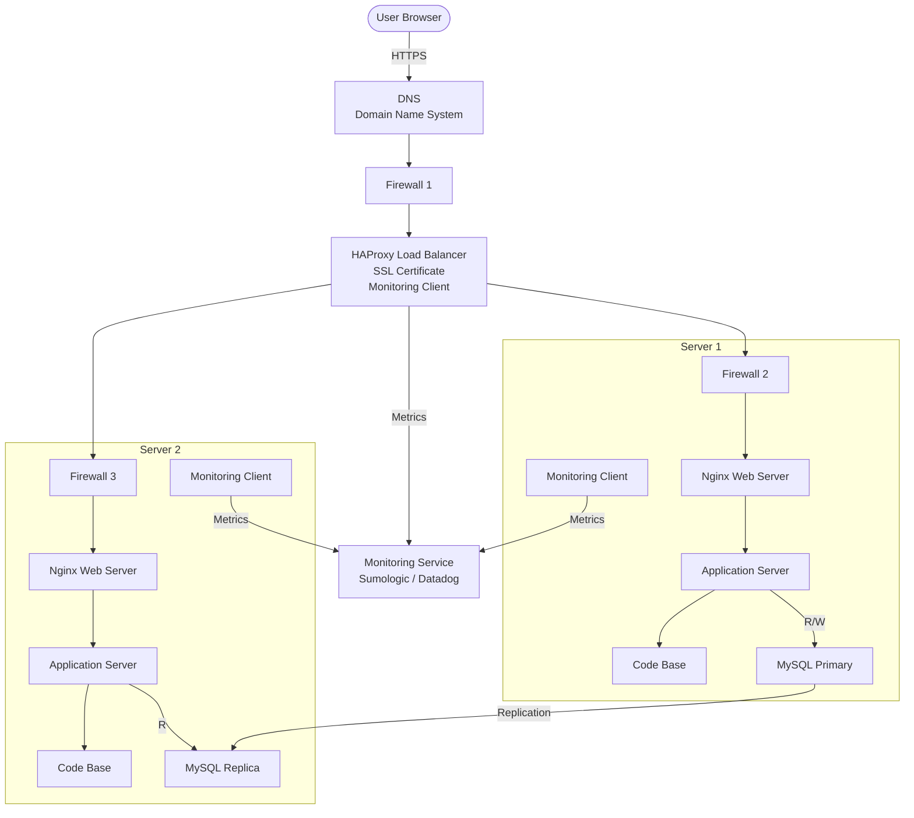

## Diagram

---

## Infrastructure Overview

The website `www.foobar.com` is served over HTTPS. A firewall sits in front of the load balancer to filter incoming traffic. Each backend server also has its own firewall. The HAProxy load balancer holds the SSL certificate and terminates HTTPS. Monitoring clients on the load balancer and both backend servers collect metrics and logs and send them to a monitoring service.

---

## Additional Elements — Why Each Was Added

**3 firewalls**
Firewalls filter network traffic in and out of a machine based on predefined rules. They block unauthorized access and reduce the attack surface. One firewall is placed in front of the load balancer to filter public traffic. The other two protect each backend server from unauthorized connections.

**SSL certificate**
The SSL certificate enables HTTPS so that traffic between the user and the website is encrypted. Without it, data exchanged between the user and the website can be read or modified by anyone who intercepts the connection.

**3 monitoring clients**
Monitoring clients collect metrics, logs, and performance data from the servers and send them to a monitoring service. Monitoring is used to check if something is broken or slow, detect anomalies, and trigger alerts before users are affected.

---

## Specifics

**What firewalls are for**
A firewall filters network traffic in and out of a machine. It allows only authorized traffic (for example HTTPS on port 443) and blocks everything else. This limits the attack surface of each server.

**Why traffic is served over HTTPS**
HTTPS encrypts the traffic between the user and the website using an SSL/TLS certificate. If someone intercepts the traffic, they cannot read it. It also verifies that the user is communicating with the legitimate server.

**What monitoring is used for**
Monitoring is used to check whether something is broken or slow, to track resource usage (CPU, memory, disk, network), to detect performance regressions, and to trigger alerts when a metric goes out of acceptable bounds.

**How the monitoring tool collects data**
A monitoring client (agent) is installed on each server. It runs continuously, collects metrics and logs from the local system and services, and sends them to the central monitoring service (Sumologic, Datadog, etc.) at regular intervals.

**How to monitor web server QPS**
To monitor the web server QPS (Queries Per Second), configure the monitoring client to read Nginx's request logs or use the Nginx stub_status module. The client counts the number of HTTP requests Nginx receives per second and sends this metric to the monitoring service. Configure an alert to trigger if QPS exceeds a defined threshold.

---

## Issues With This Infrastructure

**Terminating SSL at the load balancer**
SSL is terminated at the load balancer, meaning traffic is decrypted there. The traffic that travels between the load balancer and the backend web servers is then unencrypted (plain HTTP). If someone gains access to the internal network, they can read that traffic.

**Only one MySQL server accepting writes**
Only the Primary database can accept write operations. If the Primary goes down, the application cannot write data anymore. This is both a single point of failure and a bottleneck for write-heavy workloads.

**Servers with all the same components**
Each server runs a web server, an application server, and a database together. This is a problem for two reasons:

- Each component consumes resources differently. The database may need more memory and disk, while the application server needs more CPU. When all components share the same server, they compete for the same resources, and it becomes harder to scale one component independently.
- When maintenance is performed on one component (for example restarting the web server), it affects all other components running on the same server.

**Load balancer is a SPOF**
There is still only one load balancer. If HAProxy fails, the website becomes unreachable.
