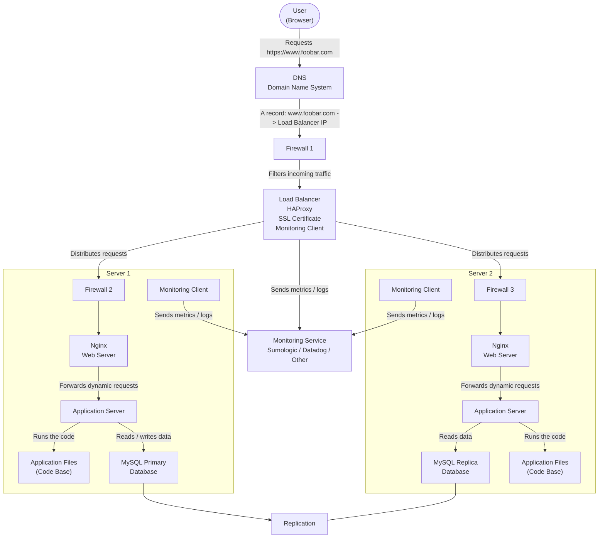

# Web Infrastructure Design

## Task 2. Secured and Monitored Web Infrastructure

### Architecture Diagram

---

### Explanation

This infrastructure represents a secured and monitored web infrastructure hosting the website `www.foobar.com`.

When a user wants to access the website, they type `https://www.foobar.com` in their browser. The browser asks the DNS system to resolve the domain name into an IP address. The DNS record points to the public IP address of the load balancer.

The traffic first goes through a firewall. The firewall filters incoming traffic and only allows authorized traffic to reach the load balancer. The load balancer, HAProxy, receives HTTPS requests and uses an SSL certificate to serve encrypted traffic.

The load balancer then distributes requests between the two backend servers. Each backend server also has a firewall to filter traffic before it reaches the web server. The Nginx web server receives the request, forwards dynamic requests to the application server, and the application server runs the code and communicates with the database.

The database still uses a Primary-Replica setup. The Primary database accepts write operations, while the Replica database copies data from the Primary and can be used for read operations.

Monitoring clients are installed on the load balancer and on both backend servers. These clients collect metrics and logs and send them to a monitoring service such as Sumologic, Datadog or another monitoring platform.

---

### Additional Elements

**Firewalls:**
Firewalls are added to improve security. They filter incoming and outgoing traffic based on rules. For example, a firewall can allow HTTP or HTTPS traffic while blocking unauthorized access to internal services such as the database.

**SSL certificate:**
The SSL certificate is added to serve the website over HTTPS. It allows encrypted communication between the user's browser and the website. It also helps prove that the user is communicating with the correct website.

**Monitoring clients:**
Monitoring clients are added to collect metrics and logs from the servers. They help detect problems, track performance and send alerts when something goes wrong.

---

### Definitions

**Firewall:**
A firewall is a security component that controls network traffic based on predefined rules. It helps protect servers from unauthorized access.

**HTTPS:**
HTTPS is the secure version of HTTP. It encrypts traffic between the user and the website, which helps protect sensitive data from being intercepted or modified.

**SSL certificate:**
An SSL certificate is used to enable HTTPS. It proves the identity of the website and allows encrypted communication.

**Monitoring:**
Monitoring is the process of collecting information about the health and performance of the infrastructure. It can include CPU usage, memory usage, disk usage, network traffic, application errors and request rates.

**Monitoring client:**
A monitoring client is an agent installed on a server. It collects metrics and logs locally and sends them to a monitoring service.

**QPS:**
QPS stands for Queries Per Second. It measures how many requests or queries a service receives every second.

---

### Monitoring Web Server QPS

To monitor the web server QPS, I would configure the monitoring client to collect Nginx request metrics. The client would count the number of HTTP requests received by Nginx per second and send this data to the monitoring service.

This would help detect traffic spikes, performance issues or abnormal activity.

---

### Issues With This Infrastructure

**SSL termination at the load balancer level:**
Terminating SSL at the load balancer means that HTTPS traffic is decrypted at the load balancer. If the traffic between the load balancer and the backend servers is not encrypted again, internal traffic may travel in plain HTTP. This can be a security issue if the internal network is compromised.

**Only one MySQL server accepting writes:**
The Primary database is the only server that can accept write operations. This is a problem because it can become a bottleneck if there are many write requests. It is also a single point of failure for write operations.

**Same components on each server:**
Each backend server contains a web server, an application server and a database. This can be a problem because each component has different resource needs. For example, the database may need more disk and memory, while the application server may need more CPU. Keeping all components together makes scaling and maintenance more difficult.

**Database replication delay:**
The Replica database may not always be perfectly synchronized with the Primary database. A short delay can happen between a write on the Primary and its replication to the Replica.

---

### Summary

This infrastructure is more secure and easier to observe than the previous one. Firewalls protect the servers, HTTPS encrypts user traffic, and monitoring clients collect metrics and logs. However, some issues remain: SSL termination at the load balancer can expose internal traffic, only one MySQL server accepts writes, and each backend server still contains all components instead of separating web, application and database roles.
