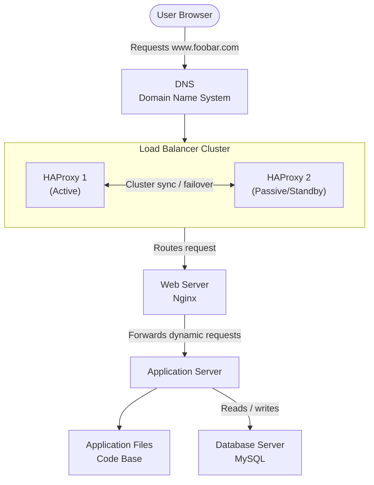

## Diagram

---

## Infrastructure Overview

This infrastructure scales up from the previous design by adding a second load balancer and splitting every component onto its own dedicated server. The two HAProxy instances form a cluster so that if one fails, the other takes over automatically. The web server, application server, and database server are now separate machines, each dedicated to a single role.

---

## Additional Elements — Why Each Was Added

**Additional server**
An additional server is added so that each component (web server, application server, database) can run on its own dedicated machine. This prevents components from competing for the same CPU, memory, and disk resources, and allows each layer to be scaled independently.

**Second load balancer (HAProxy cluster)**
A second HAProxy instance is added and configured as a cluster with the first one. The two load balancers synchronize state so that if one fails, the other takes over without interruption. This removes the load balancer as a single point of failure. If one load balancer goes down, the other continues routing traffic.

**Dedicated web server**
The web server is separated onto its own machine. Its role is to receive HTTP/HTTPS requests, serve static content, and forward dynamic requests to the application server.

**Dedicated application server**
The application server is separated onto its own machine. Its role is to run the application code and compute dynamic content. It no longer shares resources with the web server or the database.

**Dedicated database server**
The database is placed on its own server. This lets the database be configured and tuned for storage and memory without affecting the web or application layers.
