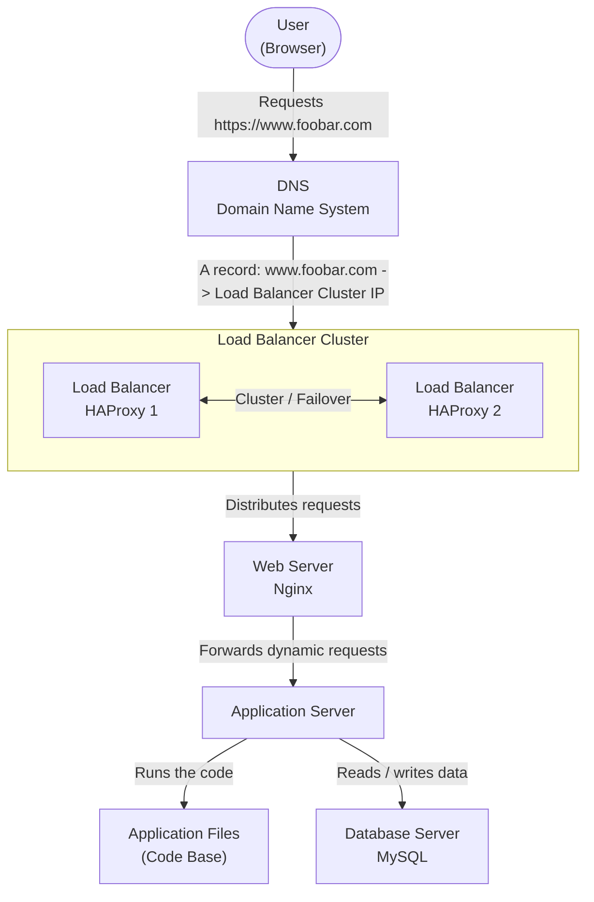

# Web Infrastructure Design

## Task 3. Scale Up

### Architecture Diagram



---

### Explanation

This infrastructure represents a scaled-up web infrastructure hosting the website `www.foobar.com`.

When a user wants to access the website, they type `www.foobar.com` in their browser. The browser asks the DNS system to resolve the domain name into an IP address. The DNS record points to the public IP address used by the load balancer cluster.

The request first reaches the load balancer layer. In this architecture, there are two HAProxy load balancers configured as a cluster. This improves availability because the infrastructure no longer depends on a single load balancer. If one load balancer fails, the other one can continue routing traffic.

After the load balancer layer, the request is sent to the web server. The web server, Nginx, receives HTTP requests and handles the web traffic. It can serve static content directly and forward dynamic requests to the application server.

The application server is now separated from the web server. Its role is to run the application logic and execute the application code. The application files are the code base used by the application server.

The database is also separated into its own server. The database server runs MySQL and stores persistent data. This separation makes the infrastructure easier to scale, maintain and troubleshoot.

---

### Additional Elements

**Additional server:**
An additional server is added so that the infrastructure can separate components instead of running everything on the same machines. This makes the architecture more scalable and easier to manage.

**Second load balancer:**
A second HAProxy load balancer is added to avoid having the load balancer as a single point of failure. If one HAProxy instance fails, the other one can continue handling traffic.

**Load balancer cluster:**
The two load balancers are configured as a cluster. This means they work together to provide high availability. One load balancer can handle traffic, and the other can take over if needed.

**Separated web server:**
The web server is separated into its own layer. Its main role is to receive web traffic, serve static files when possible, and forward dynamic requests to the application server.

**Separated application server:**
The application server is separated from the web server. Its role is to run the application logic and process dynamic requests.

**Separated database server:**
The database is placed on its own server. This allows the database to be managed and optimized independently from the web and application layers.

---

### Definitions

**Web server:**
A web server handles HTTP requests from users. In this infrastructure, Nginx receives requests from the load balancer and forwards dynamic requests to the application server.

**Application server:**
An application server runs the business logic of the website. It processes requests, executes code and generates dynamic responses.

**Database server:**
A database server stores persistent data. It can be optimized for storage, memory and data access performance.

**Load balancer cluster:**
A load balancer cluster is a group of load balancers working together to improve availability. If one load balancer fails, another one can continue routing traffic.

**Scaling up:**
Scaling up means improving the infrastructure so it can handle more traffic, be more reliable, and be easier to maintain.

---

### Why Splitting Components Helps

In the previous architectures, several components were installed on the same servers. This can become a problem because each component has different needs.

The web server mostly handles network traffic and static content.
The application server usually needs CPU and memory to process business logic.
The database server needs memory, storage and disk performance.

By separating these components, each server can be configured and scaled according to its own role.

For example:

```text
If the application becomes slow, we can scale the application server.
If the database becomes slow, we can optimize or scale the database server.
If web traffic increases, we can add more web servers.
```

This makes the infrastructure easier to scale and maintain.

---

### Issues Reduced By This Architecture

**Load balancer SPOF reduced:**
The previous infrastructure had only one load balancer. If it failed, the website became unreachable. With two HAProxy load balancers configured as a cluster, this risk is reduced.

**Better separation of responsibilities:**
The web server, application server and database server now have separate roles. This makes the system easier to understand, monitor and troubleshoot.

**Better scalability:**
Each layer can now be scaled independently. The web layer, application layer and database layer no longer need to scale together.

**Better maintenance:**
Maintenance is easier because changing or restarting one component does not necessarily require touching all the others.

---

### Remaining Possible Issues

This architecture is better, but it is still not perfect.

There is only one web server, one application server and one database server in this simplified design. Each of them can still become a single point of failure. In a real production infrastructure, we could add more web servers, more application servers and database replication.

The database can also become a bottleneck if traffic or write operations increase too much.

---

### Summary

This scaled-up infrastructure improves the previous design by adding a second load balancer and separating the web server, application server and database server. The load balancer cluster reduces the risk of a single point of failure at the entry point of the infrastructure. Splitting components makes the system easier to scale, maintain and troubleshoot.
